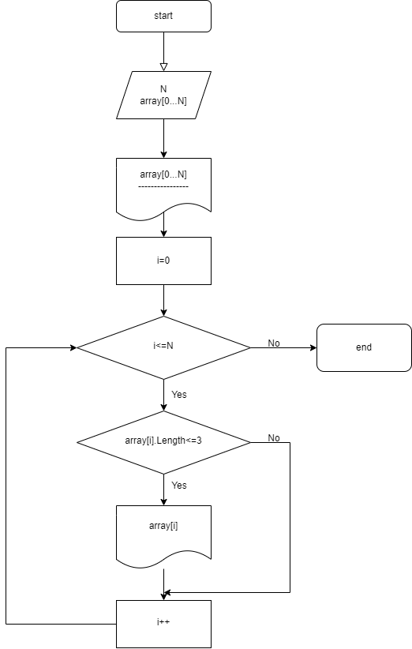

Для выполнения работы было принято в работу нижеуказанное задание:

На певом этапе была продумана логическая структура диаграммы, а также её диаграмма, которая представлена ниже:

Далее написали код. В данном коде мы создали одномерный массив, размер которого указывает пользователь, также пользователь заполняет его самостоятельно. Затем при помощи двух методов этот массив печатается на экран , сортируется и печатается на экран отсортированная версия. Результат работы представлен в файле Program.cs

В результате работы последовательно были выполнены 3 каммита